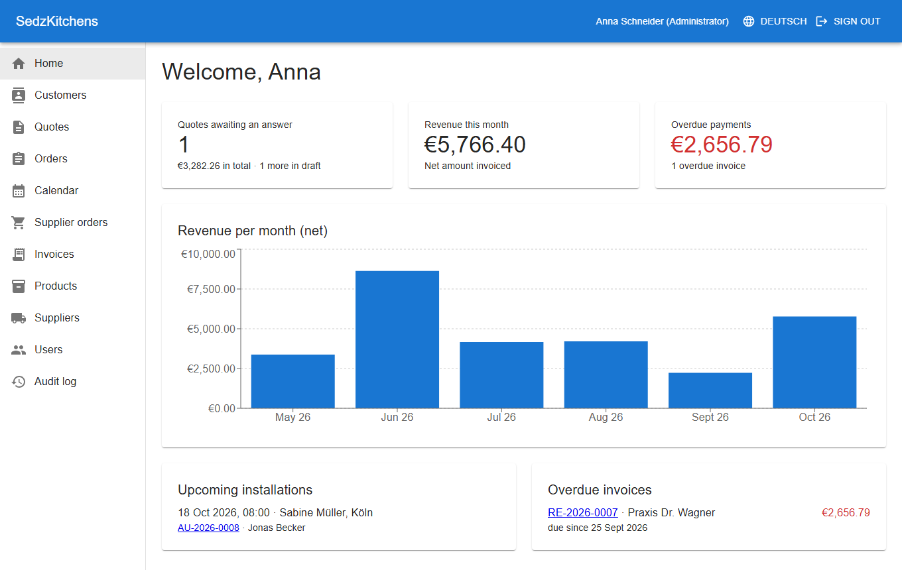
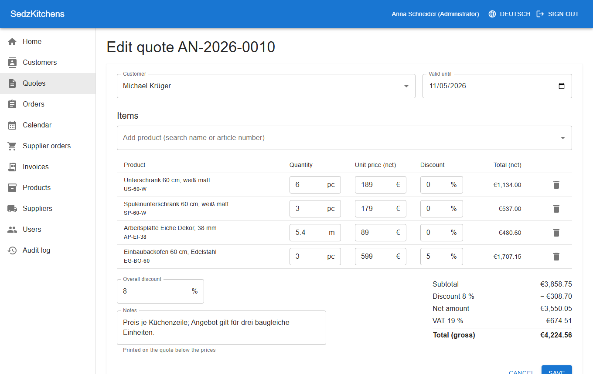
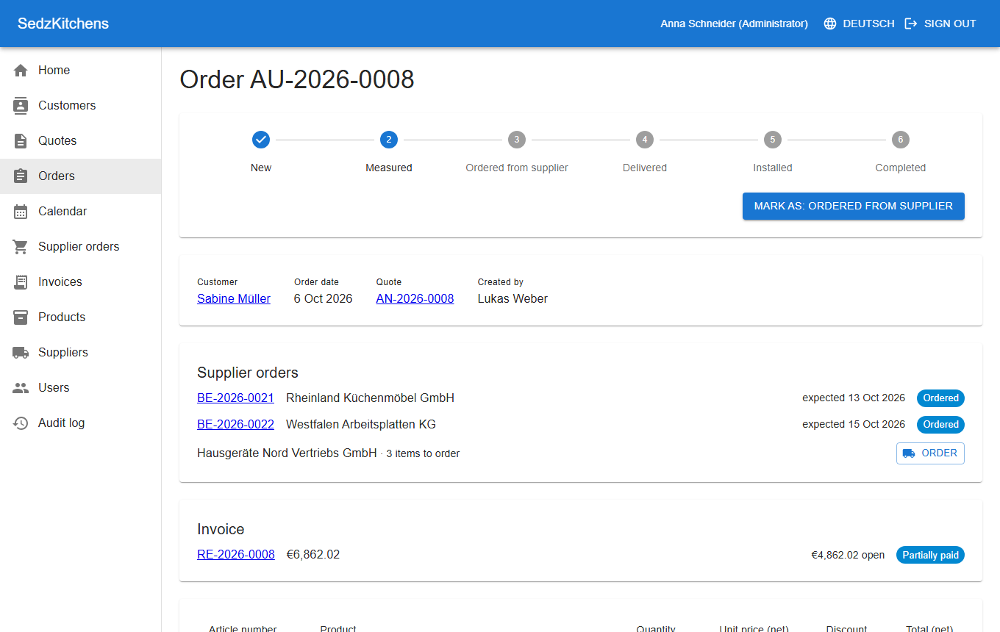
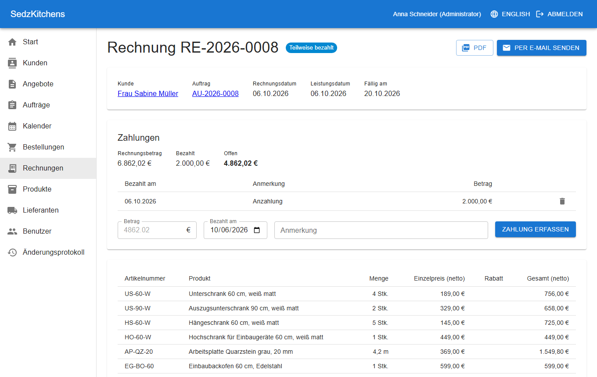
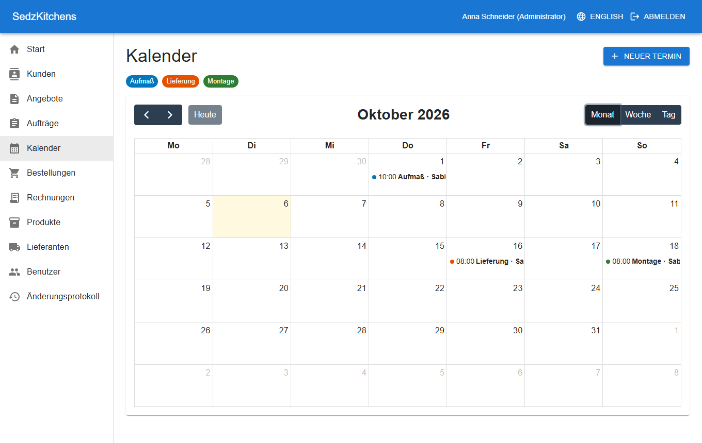
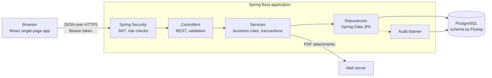
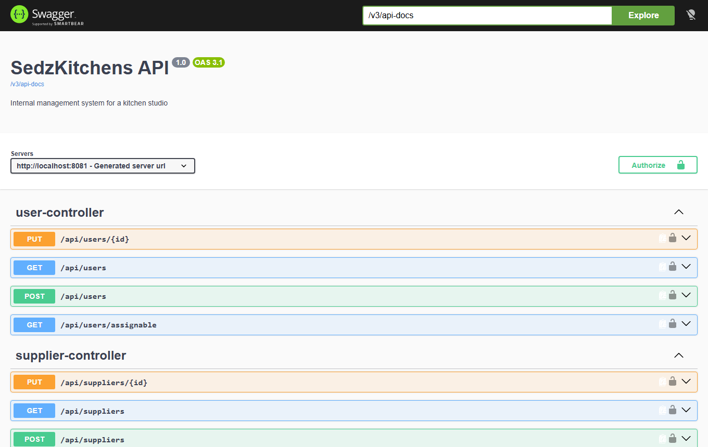

# SedzKitchens – Kitchen Studio Manager

[](https://github.com/arberzyba/kitchen-studio-manager/actions/workflows/ci.yml)

An internal management system for a kitchen studio (Küchenstudio). Employees use it to take a kitchen from first contact to final invoice: customers, quotes, orders, scheduling, supplier orders, invoices and a dashboard. Customers never log in.

Built as a portfolio project with **Java 21, Spring Boot 4, PostgreSQL** and **React, TypeScript, MUI**. The interface is available in German and English and follows German business conventions: 19 % VAT, gapless document numbers, German quote and invoice layout, and GDPR export and erasure.



## Contents

- [Features](#features)
- [Screenshots](#screenshots)
- [Roles and demo logins](#roles-and-demo-logins)
- [Tech stack](#tech-stack)
- [Architecture](#architecture)
- [Run it locally](#run-it-locally)
- [Tests](#tests)
- [Configuration and deployment](#configuration-and-deployment)
- [Design decisions](#design-decisions)
- [Limits](#limits)

## Features

| Area | What it does |
|---|---|
| **Customers** | Master data with billing and optional installation address, searchable list, contact history (calls, emails, meetings, notes) |
| **Product catalog** | Cabinets, worktops and appliances with article number, net purchase and selling price, unit (piece or running metre) and supplier |
| **Quotes** | Built from catalog products with per-line and overall discounts; net, 19 % VAT and gross calculated live; German PDF (Angebot); sent by email |
| **Orders** | Created from an accepted quote; move through new → measured → ordered from supplier → delivered → installed → completed |
| **Scheduling** | Calendar (month, week, day) for measurements, deliveries and installations, each assigned to an employee |
| **Supplier orders** | One per supplier and order, with expected and actual delivery date; late deliveries are flagged |
| **Invoices** | One per order with a gapless number; German PDF (Rechnung); partial payments; open, partially paid, paid and overdue |
| **Dashboard** | Quotes awaiting an answer, revenue per month, upcoming installations, overdue payments |
| **Users** | Admins create employees, assign roles and deactivate accounts |
| **Audit log** | Who created, changed or deleted which record, and which fields changed |
| **GDPR** | Export of everything stored about a customer; erasure that deletes or anonymizes depending on legal retention |

## Screenshots

| Quote editor with live totals | Order with supplier orders and invoice |
|---|---|
|  |  |

| Invoice with payments (German) | Calendar (German) |
|---|---|
|  |  |

## Roles and demo logins

Access is enforced on the server for every endpoint; the interface only hides what a role cannot use.

| Role | Can do | Demo login |
|---|---|---|
| **Admin** | Everything, plus users, products, suppliers, audit log and GDPR requests | `admin@sedzkitchens.de` |
| **Sales** | Customers, quotes, orders, appointments; reads invoices and supplier orders | `sales@sedzkitchens.de` |
| **Office** | Supplier orders, invoices, payments, appointments; reads customers and quotes | `office@sedzkitchens.de` |
| **Installer** | Only their own appointments, with the customer's address and phone number | `installer@sedzkitchens.de` |

The password for all demo logins is `demo1234`. They are created together with the demo data when the application starts on an empty database in development.

## Tech stack

**Backend:** Java 21, Spring Boot 4.1 (Web MVC, Data JPA, Security, Validation, Mail, Actuator), PostgreSQL 17, Flyway, Lombok, MapStruct, OpenPDF, springdoc-openapi, JUnit 5 with MockMvc and H2, Maven.

**Frontend:** React 19, TypeScript, Vite, MUI with the MUI data grid, React Router, TanStack Query, React Hook Form with Zod, FullCalendar, Recharts, react-i18next, ESLint and Prettier, Vitest, Playwright.

**CI:** GitHub Actions build and test the backend, check and build the frontend, and run the browser tests against PostgreSQL on every push.

## Architecture



The backend is organised by feature, and each feature is layered into controller, service and repository:

```
backend/src/main/java/de/sedzkitchens/
├── auth            login and token creation
├── user            employees and roles
├── customer        customers and contact history
├── supplier        suppliers
├── product         product catalog
├── quote           quotes, price calculation, quote PDF and email
├── order           orders and their status workflow
├── appointment     scheduling
├── supplierorder   orders placed with suppliers
├── invoice         invoices, payments, invoice PDF
├── dashboard       figures for the start page
├── audit           audit log
├── privacy         GDPR export and erasure
├── document        shared letter PDF layout and mail sending
├── common          error handling, document numbers
└── config          security, API docs, demo data
```

The frontend mirrors this with one folder per feature under `frontend/src`.

A few rules that shape the code:

- Controllers accept and return DTOs (Java records), never entities.
- Business rules and transactions live in services.
- Errors are returned as RFC 9457 problem details by one global handler.
- The database schema is changed only through Flyway migrations.
- Money is `BigDecimal` on the server and rounded to cents at each step.

## Run it locally

**Prerequisites:** JDK 21, Node.js 24 and PostgreSQL 17. No Docker is needed.

1. Create the database (as the PostgreSQL superuser):

   ```sql
   CREATE ROLE sedzkitchens LOGIN PASSWORD 'sedzkitchens';
   CREATE DATABASE sedzkitchens OWNER sedzkitchens;
   ```

2. Start the backend. It creates the tables and, on an empty database, the demo data.

   ```bash
   cd backend
   ./mvnw spring-boot:run        # Windows: .\mvnw.cmd spring-boot:run
   ```

3. Start the frontend in a second terminal.

   ```bash
   cd frontend
   npm install
   npm run dev
   ```

4. Open http://localhost:5173 and sign in with one of the [demo logins](#roles-and-demo-logins).

The API documentation is at http://localhost:8080/swagger-ui.html. Use a token from `POST /api/auth/login` with its "Authorize" button.



Emails are only written to the backend log unless a mail server is configured. To see real emails locally, run [Mailpit](https://mailpit.axllent.org) and uncomment the two `spring.mail` lines in `backend/src/main/resources/application-dev.properties`.

## Tests

| What | Command | Notes |
|---|---|---|
| Backend tests | `cd backend && ./mvnw verify` | Integration tests through the HTTP layer with an in-memory H2 database, unit tests for the price calculation, and a code-style check. No PostgreSQL needed. |
| Frontend unit tests | `cd frontend && npm test` | Vitest: the quote calculation and the German and English number, date and currency formats. |
| Browser tests | `cd frontend && npm run e2e` | Playwright against the running application. Needs the backend running on a freshly seeded database. |
| Lint and format | `cd frontend && npm run lint && npx prettier --check .` | |

The backend tests cover, among other things, the VAT and rounding arithmetic, document numbering, status workflows, what each role may and may not do, the contents of generated PDFs, and the GDPR export and erasure.

## Configuration and deployment

The backend has three profiles:

| Profile | Purpose |
|---|---|
| `dev` (default) | Local PostgreSQL, demo data, emails to the log |
| `prod` | Every setting from environment variables, no demo data |
| `demo` | Adds the demo data; combine as `prod,demo` for a public demo |

Environment variables for `prod`:

| Variable | Meaning |
|---|---|
| `SPRING_PROFILES_ACTIVE` | `prod`, or `prod,demo` for a demo with sample data |
| `DATABASE_URL` | JDBC URL, e.g. `jdbc:postgresql://host:5432/dbname` |
| `DATABASE_USERNAME`, `DATABASE_PASSWORD` | Database login |
| `JWT_SECRET` | At least 32 random characters; signs the login tokens |
| `FRONTEND_URL` | Address of the hosted frontend, allowed to call the API from a browser |
| `PORT` | Set by most hosting platforms; defaults to 8080 |
| `SPRING_MAIL_HOST` and related | Optional; without them emails are only logged |

The frontend is a static site. Set `VITE_API_URL` to the backend's address at build time (see `frontend/.env.example`). `frontend/vercel.json` makes client-side routes survive a page reload on Vercel.

No secret is stored in the repository. The company details printed on quotes and invoices are those of a fictional company and are set in `application.properties`.

## Design decisions

The reasoning behind the main technical choices is recorded as short architecture decision records in [docs/adr](docs/adr):

1. [Feature packages with layers inside](docs/adr/0001-feature-packages-with-layers.md)
2. [Stateless login with JWT](docs/adr/0002-stateless-login-with-jwt.md)
3. [Documents keep their own copy of the data](docs/adr/0003-documents-keep-their-own-copy.md)
4. [Gapless document numbers](docs/adr/0004-gapless-document-numbers.md)
5. [Audit log records field names, not values](docs/adr/0005-audit-log-without-values.md)
6. [GDPR erasure deletes or anonymizes](docs/adr/0006-gdpr-erasure.md)
7. [No Docker; H2 for tests](docs/adr/0007-no-docker-h2-for-tests.md)
8. [Spring Boot 4 instead of 3](docs/adr/0008-spring-boot-4.md)

## Limits

This is a portfolio project, not a product. Known gaps:

- **Invoicing:** one invoice per order for the full amount. There are no deposit invoices and no cancellation invoices (Storno).
- **Order status is set by hand.** Appointments, supplier deliveries and invoices do not move it automatically, and a step cannot be undone.
- **No double-booking check** in the calendar.
- **Login tokens** last 8 hours, are stored in the browser's local storage and cannot be revoked early. There is no refresh token.
- **PDF font:** the built-in Helvetica covers German but not every alphabet.
- **Audit log** records that a field changed, not its old and new value, and does not record reads.
- **No file uploads.** Product images and measurement photos are intentionally left out.
- **Legal correctness:** VAT handling, retention periods and GDPR behaviour follow common practice as I understand it. They have not been reviewed by a lawyer or tax adviser.
